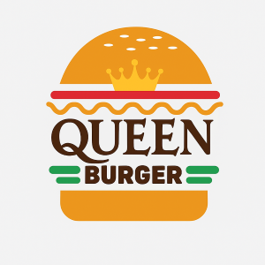
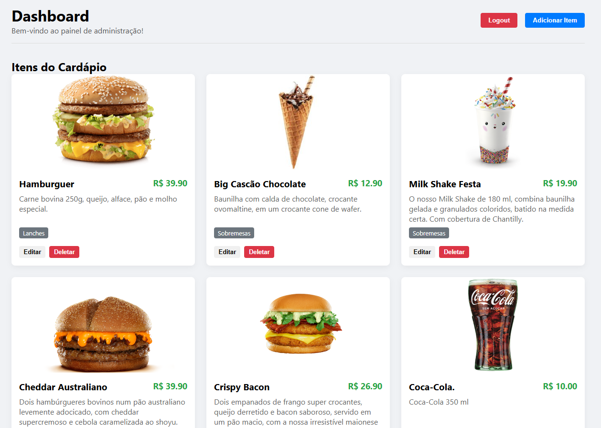
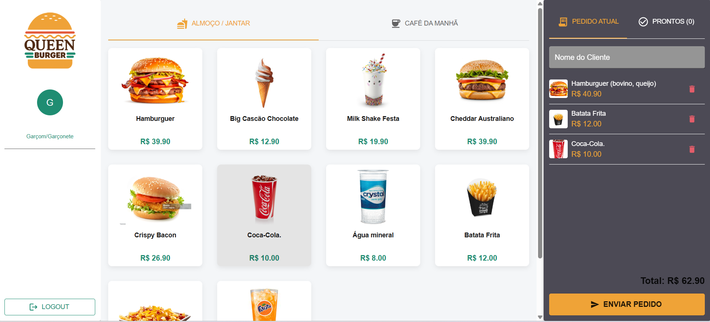
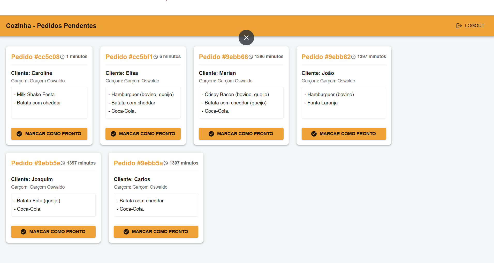
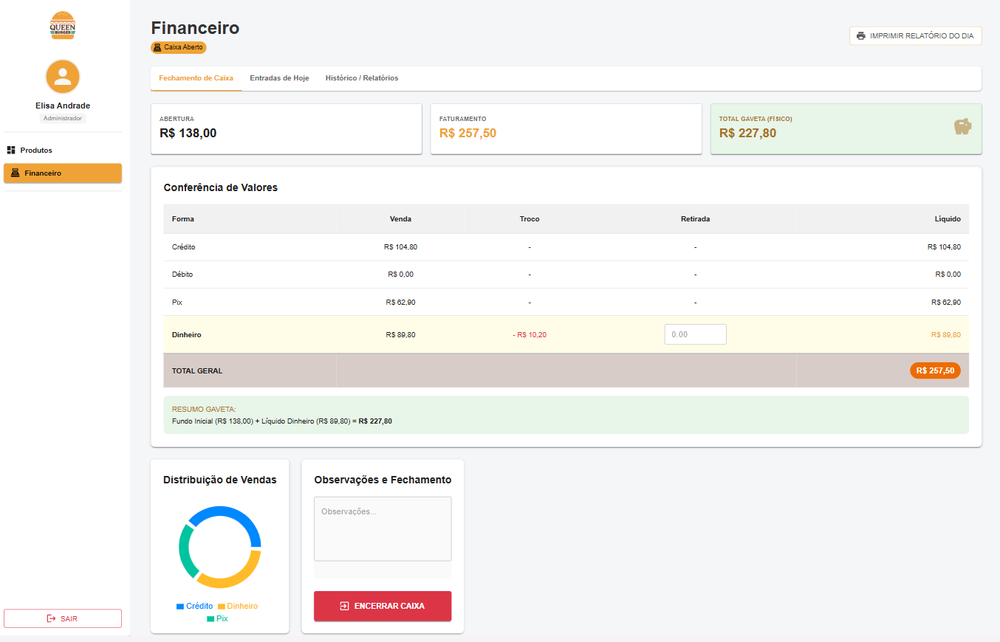

# Burger Queen - Sistema de Pedidos (PDV)



* Sistema de Ponto de Venda (PDV) completo para uma hamburgueria fictícia, construído como um projeto Full-Stack utilizando a MERN Stack. Permite o gerenciamento de produtos, controle de usuários por função (Admin, Salão, Cozinha) e o fluxo completo de pedidos, desde a anotação até a entrega.

**[https://cardapio-interativo-five.vercel.app/login]**

---

## 🚀 Funcionalidades Principais

* **Autenticação por Função:**
  * Login seguro com JWT (JSON Web Tokens) e tela de registro de funcionários.
  * Diferentes perfis de usuário:
    * **Admin:** Gerencia produtos (CRUD completo) e usuários (futuramente).
    * **Salão (Hall):** Anota pedidos dos clientes, customiza itens e gerencia pedidos prontos.
    * **Cozinha (Kitchen):** Visualiza pedidos pendentes em ordem de chegada e marca como prontos.
    * Rotas protegidas garantindo que cada usuário acesse apenas sua área designada.
* **Painel de Admin (`/dashboard`):**
  * Interface para Criar, Ler, Atualizar e Deletar (CRUD) produtos.
  * Associação de produtos a menus específicos ("Café da Manhã" ou "Resto do Dia").
  * Notificações *Toast* para feedback de ações (ex: "Item deletado com sucesso")
  * Upload/Referência de imagens (atualmente por URL).
* **💰 Módulo Financeiro & Caixa (Novo!):**
  * Um sistema completo de gestão de fluxo de caixa (PDV) integrado aos pedidos.
    * **Abertura e Fechamento de Caixa:** Controle rigoroso de turnos com fundo de troco inicial.
    * **Conferência de Valores:** Tabela detalhada para conferir vendas em Dinheiro, Pix, Crédito e Débito.
    * **Cálculos Automáticos:** Sistema inteligente que desconta trocos e sangrias (retiradas) automaticamente para prever o valor exato na gaveta.
    * **Dashboard Visual:** Gráficos de rosca (Donut Charts) para visualizar a distribuição das formas de pagamento em tempo real.
  * **Histórico e Relatórios:**
    * Consulta de fechamentos anteriores por período (data).
    * Resumo financeiro consolidado (Soma de períodos).
  * **Impressão de Comprovantes:** Geração de relatórios fiscais/gerenciais formatados para impressoras térmicas ou A4 (PDF).
* **Painel de Pedidos - Salão (`/order`):**
  * Layout profissional de 3 colunas otimizado para tablets (Navegação/Usuário, Menu, Pedido).
    * **Coluna de Menu:** Busca dinâmica de produtos da API, separados por abas de Menu (Café da Manhã / Almoço).
    * **Coluna de Pedido:**
      * Resumo do pedido com campo para nome do cliente.
      * **Controle de Quantidade (+/-):** Permite agrupar itens idênticos e ajustar a quantidade.
      * Cálculo do preço total em tempo real.
      * Botão "Enviar para Cozinha" que posta o pedido na API.
      * Aba "Pedidos Prontos" que busca (`GET /api/orders?status=ready`) e exibe pedidos prontos para entrega.
    * **Modal de Customização:** Abre um pop-up para customizar itens (ex: tipo de hambúrguer, extras).
    * * **Sistema de Pagamento:**
        * Modal dedicado para finalizar pedidos.
        * Suporte a múltiplos métodos: Crédito, Débito, PIX e Dinheiro.
        * Cálculo automático de troco para pagamentos em dinheiro.
        * Atualização de status para "Pago" e arquivamento do pedido.
* **Painel da Cozinha (`/kitchen`):**
  * Visualização em tempo real dos pedidos pendentes, ordenados por chegada.
  * Exibição do tempo decorrido desde a criação do pedido.
  * Funcionalidade para marcar pedidos como "Prontos".
* **UI Moderna:**
  * Uso de Materail UI
  * Notificações Toast (`react-toastify`) para feedback ao usuário.
  * Design responsivo (básico).

---

## 📖 Histórias de Usuário Implementadas

Este projeto foi guiado pelas seguintes histórias de usuário:

* **HU 1:** Usuário deve ter seu perfil (login/senha) e tipo (cozinha/salão/admin) para acessar o sistema e ver a tela correta para seu trabalho.
* **HU 2:** Garçom/Garçonete deve ser capaz de anotar o pedido do cliente (nome, produtos, customizações), excluir itens, ver resumo/total e enviar para a cozinha.
* **HU 3:** Chefe de cozinha deve ver os pedidos pendentes em ordem, poder marcar que estão prontos e ver o tempo de preparo.
* **HU 4:** Garçom/Garçonete deve ver os pedidos prontos para servir e poder marcar como entregues.

---

## 🛠️ Tecnologias Utilizadas

* **Front-end:**
  * React (com Vite)
  * React Router DOM (Roteamento)
  * Axios (Requisições HTTP)
  * Material UI (MUI) (Biblioteca de componentes principal)
  * @emotion/react & @emotion/styled (Motor de estilização do MUI)
  * React Toastify (Notificações)
  * JWT Decode (Leitura de Tokens JWT)
* **Back-end:**
  * Node.js
  * Express.js (Framework Web)
  * MongoDB (Banco de Dados NoSQL)
  * Mongoose (ODM para MongoDB)
  * JSON Web Token (Autenticação)
  * Bcryptjs (Hashing de Senhas)
  * Cors (Gerenciamento de CORS)
  * Dotenv (Variáveis de Ambiente)
* **Banco de Dados:**
  * MongoDB Atlas (Hospedagem Cloud)
* **Visualização de Dados:** [Recharts](https://recharts.org/) (Gráficos financeiros interativos)
* **Relatórios e Impressão:** [React-to-Print](https://github.com/gregnb/react-to-print)
* **Matemática Financeira:** [Currency.js](https://currency.js.org/) (Para cálculos monetários precisos e seguros contra erros de ponto flutuante)

---

## ✅ Testes Automatizados

O projeto inclui uma suíte de testes de integração para o Back-end, garantindo a estabilidade das regras de negócio críticas (Autenticação e Criação de Pedidos).

* **Ferramentas:**
* [Jest](https://jestjs.io/) (Framework de Testes)
* [Supertest](https://github.com/ladjs/supertest) (Requisições HTTP simuladas)

**Como rodar os testes:**

1. Acesse a pasta do back-end: `cd cardapio-backend`
2. Execute o comando:
  
```bash
  npm test
```

## 🏗️ Estrutura do Projeto (Monorepo)

Este repositório utiliza uma estrutura de monorepo, contendo os dois projetos principais:

* `cardapio-backend/`: A API RESTful em Node.js/Express.
* `cardapio-frontend/`: A aplicação React (SPA).

---

## ⚙️ Configuração e Instalação Local

Siga os passos abaixo para rodar o projeto em sua máquina:

**1. Clone o Repositório:**

```bash
git clone https://github.com/elisaaivarone/cardapio_interativo.git
cd cardapio_interativo
```

**2. Configure o Back-end:**

* Navegue até a pasta do back-end: `cd cardapio-backend`
* Instale as dependências: `npm install`
* Crie um arquivo `.env` na raiz de `cardapio-backend` com as seguintes variáveis (substitua pelos seus valores):
  
```env
DATABASE_URL=SUA_CONNECTION_STRING_DO_MONGODB_ATLAS
JWT_SECRET=SEU_SEGREDO_JWT_LONGO_E_SEGURO
```

* *Opcional: Popule o banco de dados (se necessário).*

**3. Configure o Front-end:**

* Navegue até a pasta do front-end: `cd ../cardapio-frontend`
* Instale as dependências: `npm install`
* *Nota: O front-end se conectará por padrão a `http://localhost:3001/api`. Se seu back-end rodar em outra porta, ajuste `baseURL` em `src/services/api.js`.*

**4. Execute a Aplicação:**

* **Terminal 1 (na pasta `cardapio-backend`):**
* Inicie o servidor back-end:
  
```bash
node index.js

```

* **Terminal 2 (na pasta `cardapio-frontend`):**
* Inicie o servidor de desenvolvimento front-end:
  
```bash
npm run dev
```

* Abra seu navegador em `http://localhost:5173` (ou a porta indicada pelo Vite).

---

## 📸 Screenshots

**Dashboard do Administrador (Gerenciamento de Itens):**


**Tela de Pedidos (Garçom/Salão):**


**Tela da Cozinha:**


**Dashboard Financeiro:**


---

## ⏭️ Próximos Passos

* [ ] Implementar funcionalidade "Esqueci minha senha".
* [ ] Adicionar gerenciamento de clientes e funcionários (CRUD) no painel do Admin.
* [x] Adicionar sistema financeiro e relatório
* [x] Adicionar quantidade aos itens do pedido.
* [x] Melhorar UI/UX (talvez com uma biblioteca de componentes como Material UI ou Chakra UI).
* [x] Adicionar testes unitários e de integração.
* [ ] Implementar WebSockets para atualizações em tempo real (ex: cozinha ver pedidos instantaneamente).

---

Feito com ❤️ por Elisa Aivarone!
